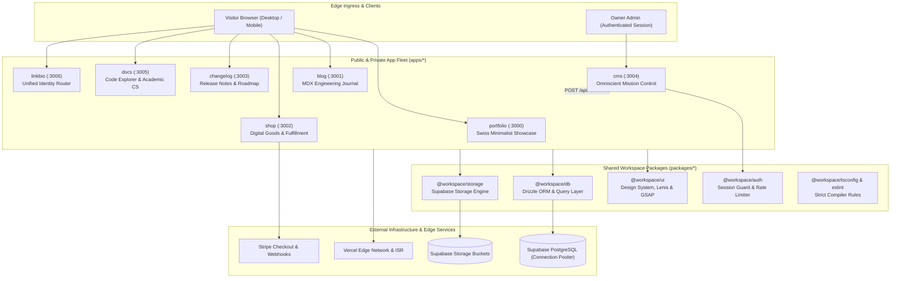
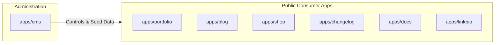
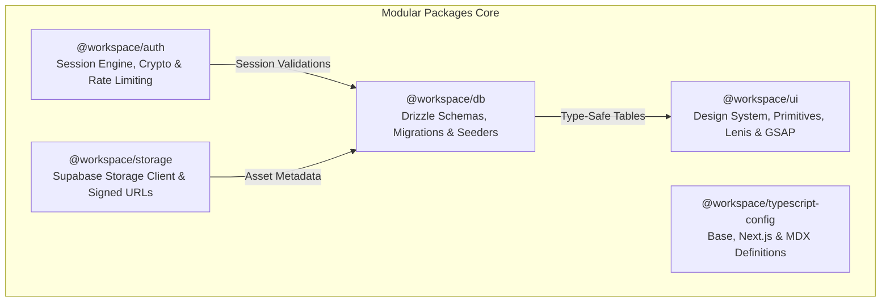
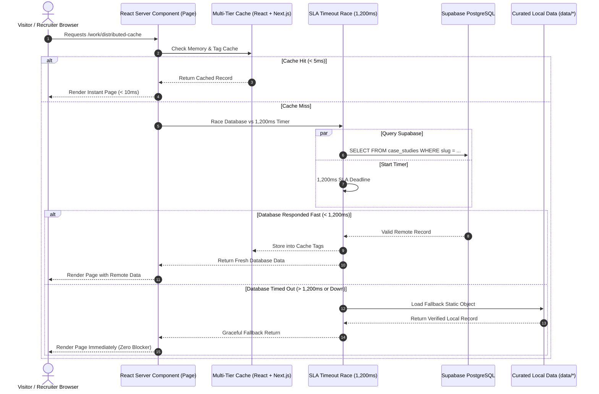
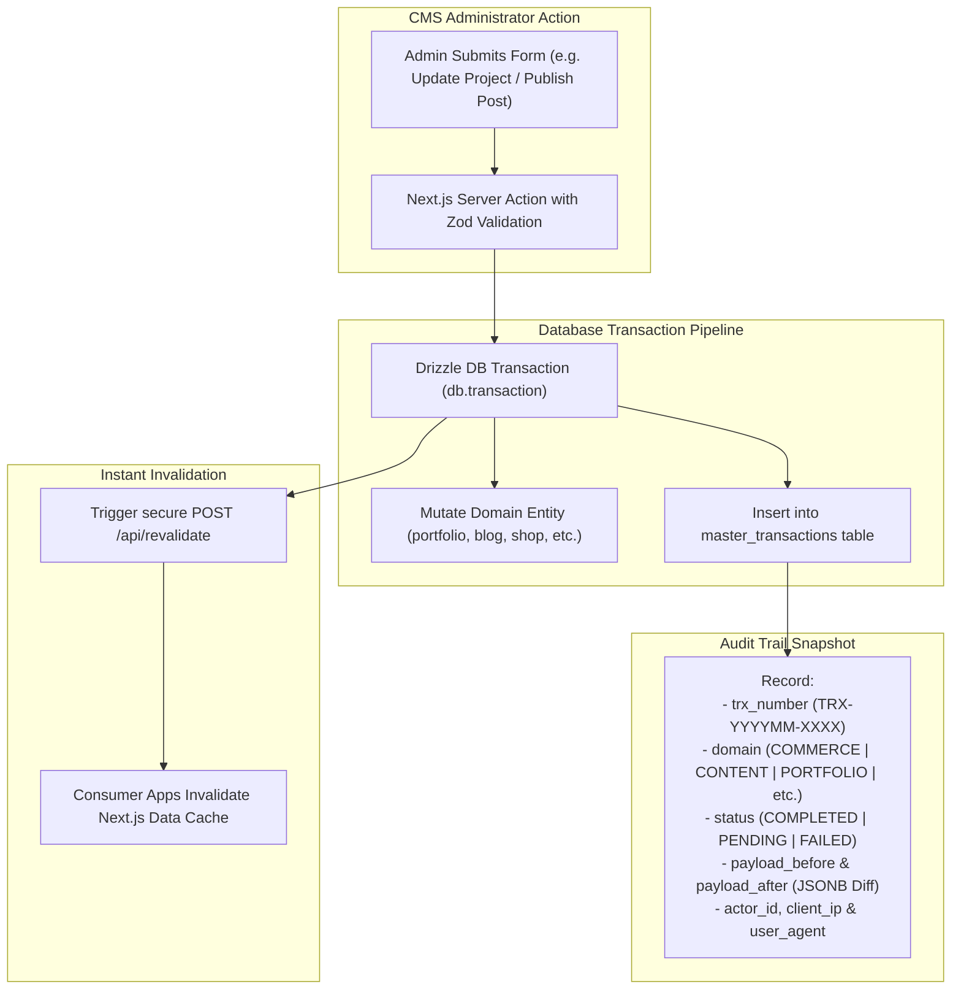
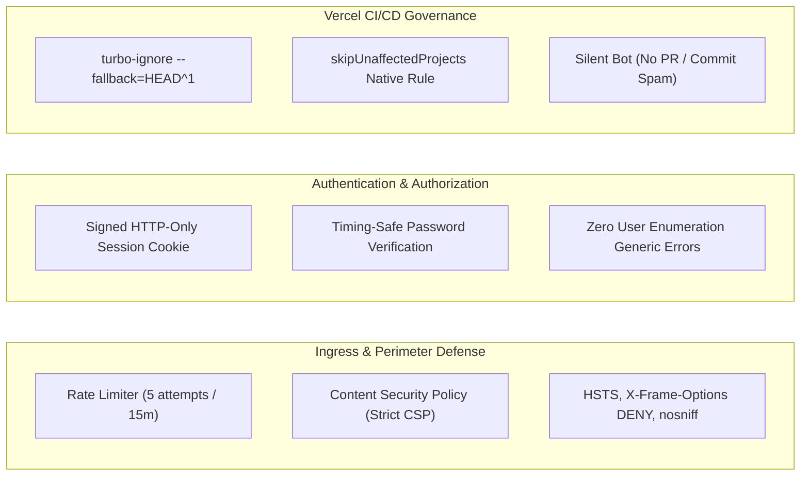

# rizfolio // ecosystem matrix

> **the unified digital presence monorepo.** built different, engineered with zero bloat, unmatched aesthetic precision, and enterprise resilience. no cap.

---

## 1. the manifesto // pure architectural sauce

most portfolios out there are just pretty static templates with dead links and zero backend muscles. **rizfolio hits entirely different.**

this isn't just a portfolio; it's a **distributed 7-application micro-frontend ecosystem** driven by a single unified monorepo. we're talking about dedicated apps for personal branding, engineering writing, digital commerce, release notes, open-source code exploration, central link routing, and an omniscient headless CMS.

under the hood, it pairs **React Server Components (RSC)** with an ultra-forgiving **multi-tier caching architecture**, a custom **1,200ms SLA fast-fallback timeout race**, strict **Zod runtime contracts**, and a **Master Transactions & Activity Ledger** that records structural before/after JSON diffs across all domain mutations.

clean vibes, zero clutter, highkey built for the long haul.

---

## 2. high-level ecosystem topology

here's how the entire fleet talks to each other without breaking a sweat:

---

## 3. the 7-app armada // fleet breakdown

every single app inside `apps/` has its own dedicated responsibility, its own custom metadata configuration, its own standalone server environment, and its own ironclad error boundary.

### 1. `apps/portfolio` // the flagship (port 3000)

- **vibe:** high-precision Swiss minimalism meets technical engineering authority. monochrome palette, fluid typography, and zero flashy gimmicks that distract from actual competency.
- **core specs:**
  - **Interactive Case Studies Engine (`/work/[slug]`):** deep-dive technical postmortems detailing system architecture, business impact, live benchmark metrics, and tech stack rationale.
  - **SLA Timeout Fast-Fallback:** wrapped with `withTimeout(query, 1200, fallback)`. if the remote database takes longer than 1.2s (e.g. cold start), it instantaneously serves curated local data from `data/case-studies.ts`. zero page freezing.
  - **Personal Branding Pillars:** dedicated sections for _Now / Current Focus_, _Engineering Principles & Mental Models (How I Think)_, _Academic Foundation Matrix_, and _Frictionless Booking / Inquiries_.
  - **UX Polish:** instant route prefetching (`prefetch={true}`), streaming skeletons (`loading.tsx`), and automated JSON-LD schemas.

### 2. `apps/blog` // engineering publication (port 3001)

- **vibe:** clean prose, high-contrast syntax highlighting, distilled knowledge.
- **core specs:**
  - **Native & Remote MDX Compilation:** supports `.mdx` files with custom components (Tabs, Steps, Callouts, File Trees, Metrics Cards).
  - **Syntax Highlighting:** server-rendered code blocks powered by Shiki and Rehype plugins (slugs, autolink headings, pretty-code).
  - **Dynamic Taxonomy:** categorization by engineering domains, tag clouds, estimated reading times, and full-text keyword indexing.
  - **RSS & Feed Pipeline:** dynamic feeds generated on the fly for RSS readers and search crawler indexing.

### 3. `apps/shop` // digital commerce storefront (port 3002)

- **vibe:** frictionless developer marketplace for starter kits, architectural templates, and consultation vouchers.
- **core specs:**
  - **Stateful Shopping Cart:** persistent client-side cart drawer synchronized across sessions with real-time currency conversions (USD / IDR).
  - **Stripe Checkout Integration:** secure webhook processing (`api/stripe/webhook`) validating cryptographic Stripe signatures, order status transitions (`PENDING` to `PAID`), and stock reservations.
  - **Digital Fulfillment Engine:** cryptographically signed download tokens via `/download/[token]` route with expiring nonces, preventing unauthorized hotlinking.

### 4. `apps/changelog` // release chronicle & roadmap (port 3003)

- **vibe:** transparent engineering progress, milestone updates, and future vision.
- **core specs:**
  - **Categorized Release Stream:** updates classified into `FEATURE`, `IMPROVEMENT`, `FIX`, and `BREAKING` badges with semantic versioning tags (`v1.x.x`).
  - **Interactive Product Roadmap:** kanban-style milestone boards (`PLANNED`, `IN_PROGRESS`, `COMPLETED`) showcasing engineering priorities.
  - **Dedicated Release Permalinks:** individual version release routes with standalone SEO tags, social graph cards, and instant quick-jump navigation.

### 5. `apps/docs` // open-source code explorer (port 3005)

- **vibe:** github-meets-modern-docs. deep code exploration without leaving the ecosystem.
- **core specs:**
  - **Code & Blob Viewer:** syntax-highlighted code tree explorer with line-numbered blobs, copy-to-clipboard snippets, and file tree breadcrumbs.
  - **Curriculum & Academic Index:** comprehensive overview of computer science university coursework, experimental prototypes, and production libraries.
  - **Multi-Criteria Filter Bar:** instant 300ms debounced search filtering by programming language, star counts, and tags.

### 6. `apps/cms` // omniscient mission control (port 3004)

- **vibe:** hyper-functional dark cockpit for the portfolio owner. zero clutter, pure administrative power.
- **core specs:**
  - **In-Place Dual Mode CRUD:** create, edit, draft, and delete workflows across 7 domain entities (Blog posts, Case studies, Documentation repos, Products, Coupons, Changelog releases, and Roadmap items).
  - **Master Activity & Transactions Ledger (`/transactions`):** visualizes audit logs across 6 domains (`COMMERCE`, `CONTENT`, `PORTFOLIO`, `CODE_DOCS`, `AUTH_SECURITY`, `SYSTEM`) with structured JSON diff modals (`payloadBefore` vs `payloadAfter`).
  - **Media Library Asset Browser (`/media`):** direct storage manager with drag-and-drop uploads, instant CDN URL generation, and asset deletion.
  - **Instant ISR Dispatcher:** automatically broadcasts cache invalidation webhooks to consumer applications upon data modification.

### 7. `apps/linkbio` // identity gateway (port 3006)

- **vibe:** ultra-responsive, mobile-first unified link tree tailored for bio links and developer profiles.
- **core specs:**
  - **Connected Ecosystem Grid:** direct quick-links to all sibling apps with live operational status dots.
  - **Social Matrix:** verified handles across GitHub, LinkedIn, X, Discord, and Email with accessible tap targets.
  - **Universal Theme Sync:** reads and inherits the monorepo's shared color scheme in lockstep with the other web properties.

---

## 4. workspace packages matrix (`packages/*`)

the secret to why this monorepo doesn't turn into spaghetti code: strict separation of concerns across reusable packages.

| Package                            | Purpose & Responsibilities                                                                                                   | Tech Stack & Patterns                                   |
| :--------------------------------- | :--------------------------------------------------------------------------------------------------------------------------- | :------------------------------------------------------ |
| **`@workspace/db`**                | Single source of truth for database operations, relational schemas, Zod validators, seeders, and keep-alive scripts.         | Drizzle ORM, Postgres.js pooler, Zod, TypeScript Strict |
| **`@workspace/ui`**                | Central design system containing atomic UI components, smooth scroll wrappers, GSAP motion providers, and shared typography. | Tailwind CSS, Base UI, Lucide Icons, GSAP, Lenis        |
| **`@workspace/auth`**              | Cryptographic session tokens, timing-safe password validations, role guards, and sliding-window rate limiters.               | Jose, Web Crypto API, In-Memory Rate Limiting           |
| **`@workspace/storage`**           | Storage bucket abstraction for uploading, listing, signing, and pruning media assets.                                        | Supabase JS Storage Client, CDN URL Generators          |
| **`@workspace/typescript-config`** | Standardized `tsconfig.json` bases across web apps, libraries, and MDX modules with path aliases (`@workspace/*`).           | TypeScript 5.x                                          |

---

## 5. resilience & fast-fallback architecture

ever visited a portfolio hosted on free/serverless databases and had to stare at a blank white screen for 10 seconds because the database was sleeping? **not on our watch.**

### how this slaps:

1. **Multi-Tier Caching:** wrapped in React 19 `cache()` for intra-request memoization (metadata + page component call the query only once) and Next.js `unstable_cache()` with distinct tags (`['case-studies', 'portfolio']`).
2. **SLA Timeout Race:** if the remote network lags beyond 1,200ms, the system gracefully steps back to rock-solid static fallbacks without throwing an unhandled exception or freezing user interaction.
3. **Instant Skeleton Streaming:** every dynamic route boasts a bespoke `loading.tsx`, giving visitors immediate visual feedback within milliseconds.

---

## 6. master transactions & system ledger

accountability is everything. whenever an administrator modifies any record in the CMS, the action doesn't just quietly alter a row—it writes an immutable event into the `master_transactions` ledger.

### audit domains recorded:

- `COMMERCE`: order payments, stock decrements, digital token creation, coupon redemptions.
- `CONTENT`: blog article publications, revisions, tag updates, category assignments.
- `PORTFOLIO`: case study revisions, service offerings, academic entries, experience timeline updates.
- `CODE_DOCS`: repository mirrors, release tags, code tree modifications.
- `AUTH_SECURITY`: admin login events, brute-force lockouts, session revokations.
- `SYSTEM`: maintenance pings, database seeding runs, storage cleanup routines.

---

## 7. security hardening & governance

we don't mess around with security. this monorepo is locked down tight:

- **Strict Content Security Policy (CSP):** configured per application via `vercel.json` with granular rules for scripts, styles, images (`res.cloudinary.com`, `unsplash.com`, `supabase.co`), and frame restrictions (`frame-ancestors 'none'`).
- **Session Guard & Cookie Hardening:** session cookies are marked `HttpOnly`, `SameSite=Lax`, and `Secure` with timing-safe hash comparisons against constant-time cryptographical standards.
- **Brute-Force & Enumeration Mitigation:** login attempts are throttled to 5 failures per 15-minute sliding window; invalid credentials return unified ambiguous error messages to prevent account harvesting.
- **Zero Deployment Spam:** Vercel deployment checks use `npx turbo-ignore --fallback=HEAD^1` and `skipUnaffectedProjects` so documentation or isolated package updates don't spam 7 continuous build checks to GitHub.

---

## 8. the engineering code of conduct

under the hood, this entire codebase strictly abides by an uncompromising engineering standard:

> **Reuse before create.**  
> **Simplify before abstract.**  
> **Fix before rewrite.**  
> **Optimize only when necessary.**  
> **Never add complexity without a clear benefit.**

- **Hierarchy of Priorities:** `Correctness > Security > Maintainability > Performance > Simplicity > Extra Features`.
- **Zero Comments & Zero Emoji Policy:** code logic remains self-documenting through pristine naming conventions, strict types, and modular decomposition without noisy filler.
- **Type Safety Over Everything:** zero `any` shortcuts, strict TypeScript compiler options enabled across all workspaces, and Zod runtime schema assertions guarding every boundary.

---

  <b>rizfolio ecosystem</b> &bull; engineered with precision, passion, and modern standards.

